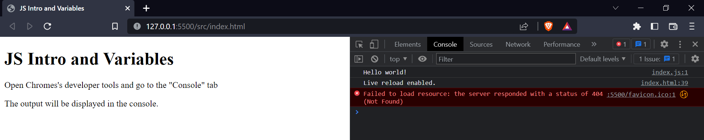
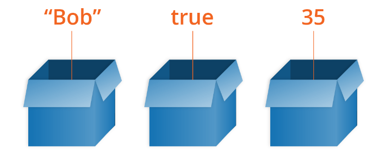
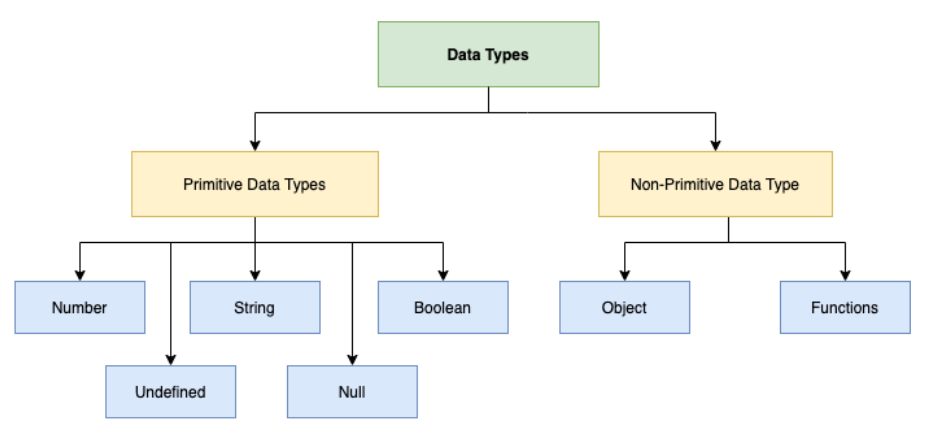

## Brief

### Lesson Overview

This lesson will give the learners an introduction to JavaScript. Learners will be learn the syntax to create simple statements and operations. 

---

## Part 1 - What is JavaScript

JavaScript is a powerful programming language that can add interactivity to a website.

It allows you to implement complex features on web pages — every time a web page does more than just sit there and display static information for you to look at.

JavaScript is relatively compact, yet very flexible. Developers have written a variety of tools on top of the core JavaScript language, unlocking a vast amount of functionality with minimum effort.

For this module, the focus is on core JavaScript concepts from programming, syntax, up until webpage manipulation.

### What JavaScript can do

- JavaScript can change HTML Content
- JavaScript can change HTML Attribute Values
- JavaScript can change HTML Styles (CSS)
- JavaScript can add functionality to HTML elements

### JavaScript files and where to place them.

JavaScript (JS) files end with .js extension. They can be integrated to HTML files via the ```script``` tag. The src attribute refers to the relative path of the js file location.

Placing scripts at the bottom of the <body> element improves the display speed, because script interpretation slows down the display.

```html
<script src="./index.js"></script>
```

### Hello World and console in JavaScript

Below is a sample of a JS statement that prints "Hello world" in the browser's console.

```js
// index.js
console.log("Hello World");
```

In order to view the output, go to Chrome Developer Tools and go to the console tab.



The console is a useful tool for showing output as well as debugging (fixing) JavaScript code. It can contain both logs and error messages to help determine the issues within the code.

---

## Part 2 - JavaScript Variables and Data types

Variables are containers for storing data (storing data values).



Variables can contain just about anything — not just strings and numbers. Variables can also contain complex data and other structures.

### Declaring variables

Variables are declared using `var`, `let`, or `const`.

The `var` keyword is used in all JavaScript code from 1995 to 2015.

The `let` and `const` keywords were added to JavaScript in 2015.

`let` is used for variables (values can change).

`const` is used for constants (value don't change).

```js
const legalName = "John Doe";
//legalName = "John Smith"; // Error as it's a constant
console.log("legalName", legalName);

let age; // declared but not initialized
console.log("age before assignment", age);
age = 18; // assigning value to age
console.log("age after assignment", age);
```

Notes about variable names:
1. Use only alphanumeric characters (0-9, a-z, A-Z) and the underscore character.
2. Variables can not start with numbers.
3. Use "lower camel case", where you stick together multiple words, using lower case for the whole first word and then capitalize subsequent words. (Ex. firstName)
4. Variables are case sensitive
5. Make variable names intuitive, so they describe the data they contain.

### Data Types

Data types are the types of information that can be stored in variables.

Data types fall into two main categories, primitive and non-primitive dataypes



Primitive data types:
1. String - alphanumeric values enclosed in quotation marks
2. Number - numeric values (whole inegers and decimal values)
3. Boolean - truth values (true or false)
4. Undefined - no assigned value (variable only been declared)
5. Null - no actual value

Non-primitive data types
1. Object - arrays and key-value pairs
2. Functions - code blocks that perform a specific functionality

```js
const num = 1;
console.log("num",typeof num);

const str = "1";
console.log("str",typeof str);

const bool = true;
console.log("bool",typeof bool);

let x;
console.log("x",typeof x);

const y = null;
console.log("y",typeof y);

const arr = ["Apple", "Banana", "Orange"];
console.log("arr",typeof arr);

const obj = {firstName: "John", lastName: "Smith"};
console.log("obj",typeof obj);
```
*Note to instructor: typeof null is an object. (https://developer.mozilla.org/en-US/docs/Web/JavaScript/Reference/Operators/typeof#typeof_null)*

---

## Part 3 - Operations

There are 4 main types of operations:
1. Arithmetic
2. Assignment
3. Comparison
4. Logical

### Arithmetic

The arithmetic operations are used for numbers:
1. Addition - x + y
2. Subtraction - x - y 
3. Multiplication - x * y
4. Division - x / y
5. Modulo(Remainder) - x % y

```js
let firstNum = 17;
let secondNum = 4;

console.log(x + y);
console.log(x - y);
console.log(x * y);
console.log(x / y);
console.log(x % y);
```

### Assignment Operator

The assignment operator is used to assign values to variables.

```js
let grade = 95;
grade = 100;
console.log("Grade:", grade);

let studentName = "Stan";
studentName = "Stanley";
console.log("Name:",studentName);
```

The assignment and arithmetic operators can also be combined as a shorthand.

```js
let newNumber = 5;
newNumber += 6;
console.log(newNumber);
```
The line `newNumber += 6` is a shorthand for `newNumber = newNumber + 6`, meaning we add 6 to the current value of newNumber and assign it back to newNumber.

### Comparison operators

Comparison operators are used to compare two statements or values. The result is always a boolean value (true or false). This is handy for decision making via control structures.

1. Greater than - x > y
2. Greater than or equal to - x >= y
3. Less than - x < y
4. Less than or equal to - x <= y
5. Equality - x == y
6. Strict Equality (compares type as well) - x === y
7. Not equal to - x != y
8. Strict not equal to - x !== y

```js
console.log(1 == 1);
console.log(2 > 6);
console.log(1 == "1");
console.log(1 === "1");
console.log(5 != 10);
```

### Logical Operators

Logical operators are used to combine multiple truth values.

1. AND (&&) - x && y -> returns true only if ALL values are True
2. OR (||) - x || y -> returns true as long as a value is True
3. NOT (!) - !x -> returns the opposite value

```js
console.log(true && false);
console.log(true && true);
console.log(true || false);
console.log(true || true);
console.log(!true);
```